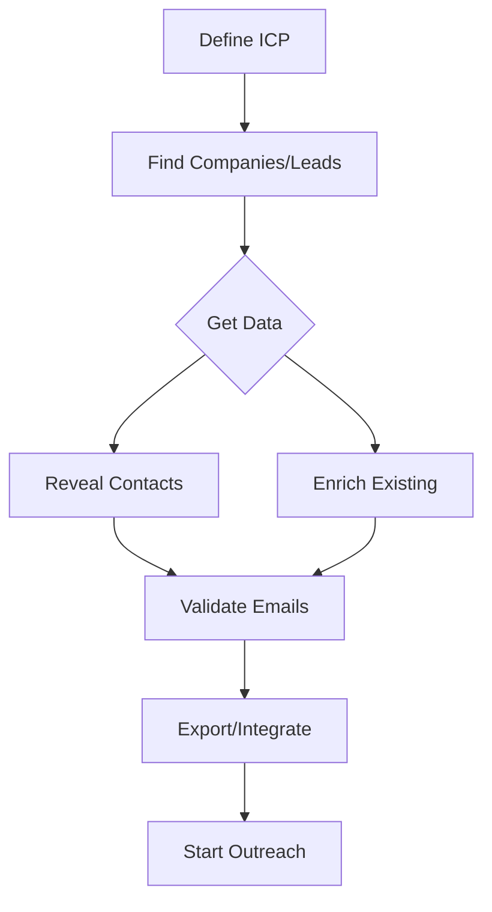

A typical end-to-end workflow looks like this:  
**Define your ICP → Find companies or leads → Get contact data → Validate emails → Export/Integrate → Start outreach**

## Step-by-Step Breakdown

### Build Your ICP (Ideal Customer Profile)

Define the attributes of your target customer.  
You can specify:

- Industry
- Company size
- Location
- Technology stack (optional but useful)
- Job titles, skills, and other criteria

### Find Target Companies and Leads

Use your ICP to run a company or lead search.  
You can:

- Apply additional filters to narrow down results
- Exclude unwanted audiences (for example, existing customers) using exclude lists

### Get Contacts for Decision-Makers

Select relevant roles such as CEO, CTO, VP Sales, Head of Marketing, etc.  
Generect will automatically:

- Identify contacts that match your criteria
- Provide verified emails and direct phone numbers
- Use AI Corporate Email Finder to generate corporate emails when necessary

### Validate Before Sending

Ensure your emails are deliverable.  
Generect provides:

- Standard email validation
- Detection of fake or disposable emails
- Catch-All Email Validation with confidence scoring

### Export or Integrate Your Data

You can:

- Download results in CSV/XLSX for email tools
- Sync your data directly with your CRM

### Start Personalized Outreach

Use your verified contact data to:

- Create tailored outreach sequences
- Improve reply rates with accurate, up-to-date information

<Card title="Learn More About ICP Search" icon="magnifying-glass" href="/docs/icp-search">
  Deep dive into building effective ICP searches
</Card>
